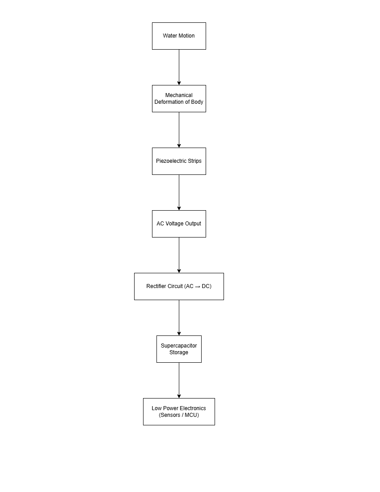
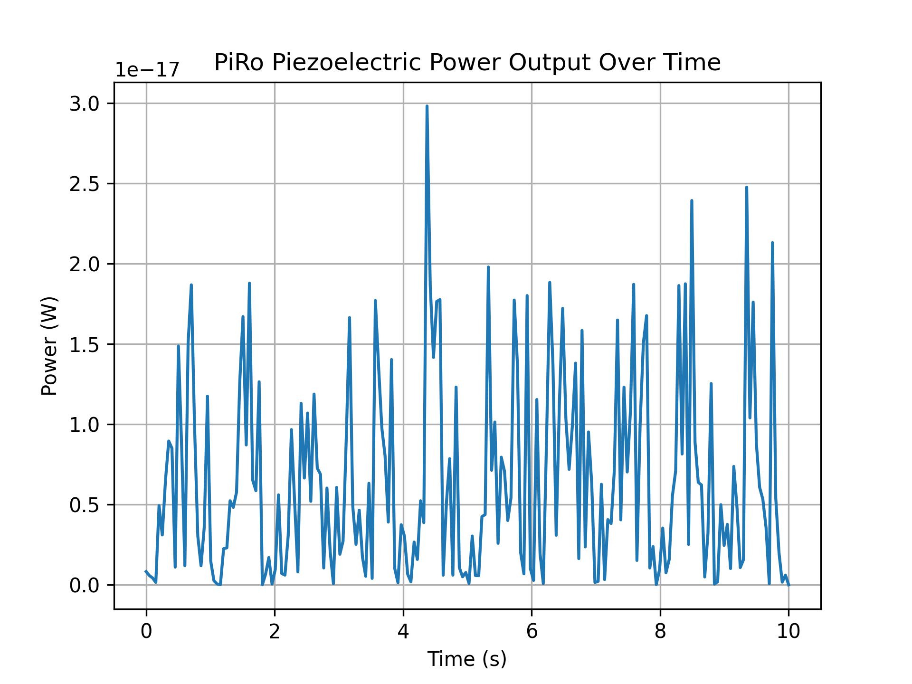
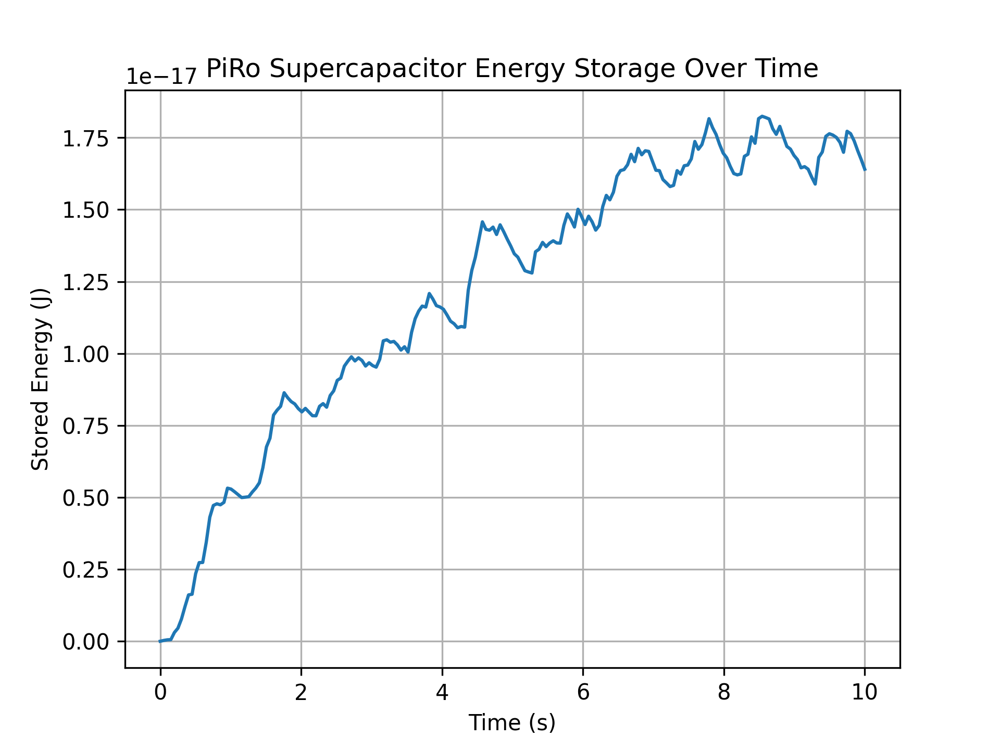
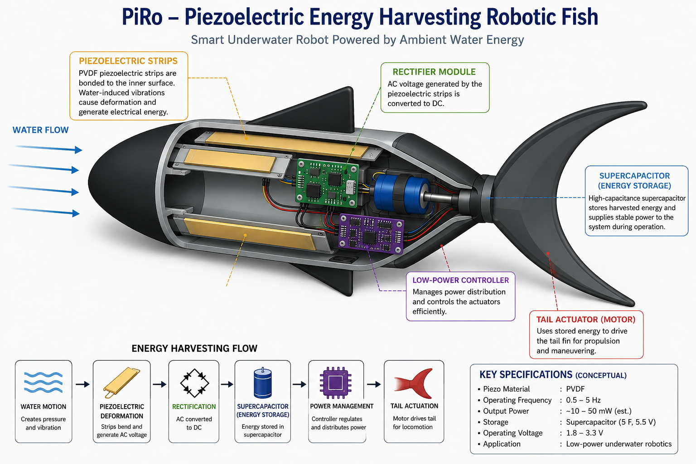

# PiRo (Piezoelectric Robot)

PiRo is a conceptual underwater robotic fish exploring piezoelectric energy harvesting as an auxiliary power mechanism for low-power marine robotics.

The project investigates whether mechanical energy from fluid motion and structural deformation can be partially converted into electrical energy and stored in supercapacitors to extend operational lifetime of autonomous underwater systems.

---

## Key Idea

Water motion → mechanical deformation → piezoelectric conversion → rectification → supercapacitor storage → low-power electronics

---

## Core Objective

To evaluate piezoelectric energy harvesting as a **battery-assist system**, not a replacement, in underwater robotic applications.

---

## System Overview

---

## Key Physical Constraints

- Hydrostatic pressure does not generate usable electrical output
- Piezoelectric output is extremely low (µW–mW range)
- Propulsion requires significantly higher power (W range)
- Energy conversion losses reduce overall efficiency

---

## Key Equation

Q = d × F

E = ½ C V²

---

## Repository Structure

- `concept.md` → Full technical explanation
- `assets/` → System diagrams and visuals
- `simulations/` →  Python energy harvesting model
- `cad/` →  mechanical concept and annotated layout
- `results/` → simulation output graphs

---

# Engineering Analysis of PiRo

## Purpose

This section presents the engineering principles, governing equations, physical limitations, and analytical calculations underlying PiRo (Piezoelectric Robot).
It focuses on the mathematical feasibility of piezoelectric energy harvesting for underwater robotic propulsion.

---

# 1. Piezoelectric Charge Generation

The fundamental operating principle of PiRo is based on the direct piezoelectric effect.

When a piezoelectric material experiences mechanical stress, electric charge is generated according to

\[
Q = dF
\]

where

- **Q** = generated electric charge (C)
- **d** = piezoelectric charge coefficient (C/N)
- **F** = applied mechanical force (N)

This relationship shows that electrical charge is directly proportional to the applied mechanical force.

For PiRo, the mechanical loading originates from underwater flow, turbulence, oscillatory body deformation, and tail flexure rather than static compression.

Therefore, continuous electrical generation depends on continuously changing mechanical stress rather than constant pressure.

---

# 2. Voltage Generation

While the piezoelectric effect first generates electrical charge, the resulting voltage depends on the material properties and the mechanical stress experienced by the piezoelectric element.

The generated open-circuit voltage can be approximated by

\[
$V = g_{31}t\sigma$
\]

where

- **V** = generated voltage (V)
- **g₃₁** = piezoelectric voltage coefficient (Vm/N)
- **t** = thickness of the piezoelectric material (m)
- **σ** = applied mechanical stress (N/m²)

For a representative piezoelectric ceramic,

\[
g_{31}=0.022\ \mathrm{Vm/N}
\]

Assuming

- thickness

\[
t=3\times10^{-4}\ \mathrm{m}
\]

- stress variation

\[
\sigma=10^{5}\ \mathrm{N/m^2}
\]

the estimated voltage becomes

\[
V=0.022\times3\times10^{-4}\times10^{5}
\]

which gives

\[
V\approx0.66\ V
\]

This represents a moderate voltage generated from a significant mechanical loading cycle.

Under stronger dynamic bending or resonance conditions, voltage peaks of approximately **2–10 V** may be produced for very short durations.

It is important to note that although the voltage may be relatively high, the available current remains extremely small. Consequently, the electrical energy contained within each pulse is limited, requiring intermediate energy storage before useful work can be performed.

---

# 3. Energy Storage

The electrical energy generated by the piezoelectric elements is accumulated within a capacitor bank before being supplied to the propulsion system.

The energy stored inside a capacitor is given by

\[
E=\frac{1}{2}CV^{2}
\]

where

- **E** = stored electrical energy (J)
- **C** = capacitance (F)
- **V** = capacitor voltage (V)

This equation demonstrates that stored energy increases linearly with capacitance and quadratically with voltage.

However, increasing capacitance indefinitely is not always beneficial for piezoelectric energy harvesting.

For a piezoelectric element producing a fixed amount of electrical charge, the voltage increase after each harvesting cycle is

\[
\Delta V=\frac{Q}{C}
\]

where

- **ΔV** = voltage rise per harvesting cycle
- **Q** = generated charge
- **C** = storage capacitance

As the storage capacitance becomes larger, the voltage increase produced by each harvested charge packet becomes significantly smaller.

Consequently,

- charging becomes slower,
- rectification losses become more significant,
- leakage currents become increasingly important,
- useful electrical energy is accumulated less efficiently.

For this reason, PiRo adopts a two-stage energy storage philosophy consisting of a small high-voltage buffer followed by a larger energy storage capacitor bank rather than directly connecting a very large capacitor to the piezoelectric source.

---

# 4. Energy Gap Analysis

The principal engineering challenge of PiRo is the large difference between the energy that can realistically be harvested by piezoelectric materials and the energy required to drive a propulsion motor.

The energy required for one propulsion pulse is

\[
E=P\times t
\]

where

- **E** = required energy (J)
- **P** = motor power (W)
- **t** = operating time (s)

Assuming a small DC motor requiring

\[
P=0.30\ W
\]

operating for

\[
t=0.30\ s
\]

the required energy becomes

\[
E=0.30\times0.30=0.09\ J
\]

Therefore, a single tail flick requires approximately

\[
0.09\ J
\]

of stored electrical energy.

In contrast, a practical underwater piezoelectric harvester typically produces electrical power on the order of

\[
0.01-0.10\ W
\]

under favorable dynamic loading conditions.

This creates a significant power mismatch between harvested energy and propulsion requirements.

Consequently, continuous motor operation cannot be achieved solely through direct piezoelectric harvesting.

Instead, PiRo adopts an intermittent propulsion strategy in which electrical energy is accumulated gradually within a capacitor bank and discharged periodically to produce short propulsion bursts.

This approach allows the harvested energy to be utilized more efficiently while remaining consistent with the physical limitations of piezoelectric energy harvesting.

---

# 5. Capacitor Sizing for Propulsion

Once the energy required for a propulsion pulse is known, the storage capacitance can be estimated using the capacitor energy equation.

When the capacitor discharges from an initial voltage \(V_1\) to a final voltage \(V_2\), the usable electrical energy is

\[
E=\frac{1}{2}C\left(V_1^2-V_2^2\right)
\]

Rearranging for capacitance,

\[
C=\frac{2E}{V_1^2-V_2^2}
\]

Using the previously calculated propulsion energy

\[
E=0.09\ J
\]

and allowing the capacitor voltage to decrease from

\[
V_1=5.0\ V
\]

to

\[
V_2=3.0\ V
\]

gives

\[
C=\frac{2(0.09)}{5^2-3^2}
\]

\[
C=\frac{0.18}{25-9}
\]

\[
C=\frac{0.18}{16}
\]

\[
C=0.01125\ F
\]

or approximately

\[
11.25\ \text{mF}
\]

This value represents the theoretical minimum capacitance required to deliver one propulsion burst under ideal conditions.

In practice, additional capacitance is required to compensate for equivalent series resistance (ESR), switching losses, rectification losses, and motor startup current.

Consequently, a practical PiRo prototype would likely employ a capacitor bank in the range of **10–50 mF**, depending on the propulsion system and desired burst duration.

---

# 6. Recharge Time Analysis

The time required to accumulate sufficient electrical energy for propulsion depends on the average harvested power.

Recharge time is estimated using

\[
t=\frac{E}{P}
\]

where

- **t** = recharge time (s)
- **E** = required stored energy (J)
- **P** = average harvested power (W)

Using the previously calculated propulsion energy

\[
E=0.09\ J
\]

the recharge time can be estimated for several realistic harvesting scenarios.

### Case 1 — Optimistic Harvesting

Average harvested power

\[
P=2\ \text{mW}=0.002\ W
\]

\[
t=\frac{0.09}{0.002}=45\ s
\]

Recharge time:

**≈ 45 seconds**

---

### Case 2 — Moderate Harvesting

Average harvested power

\[
P=0.5\ \text{mW}=0.0005\ W
\]

\[
t=\frac{0.09}{0.0005}=180\ s
\]

Recharge time:

**≈ 3 minutes**

---

### Case 3 — Low Harvesting

Average harvested power

\[
P=0.05\ \text{mW}=0.00005\ W
\]

\[
t=\frac{0.09}{0.00005}=1800\ s
\]

Recharge time:

**≈ 30 minutes**

---

These calculations demonstrate that continuous propulsion is generally not feasible using piezoelectric harvesting alone.

However, intermittent propulsion becomes physically achievable by slowly accumulating energy within the capacitor bank before periodically releasing it to produce short propulsion bursts.

Consequently, PiRo is best interpreted as a low-duty-cycle, energy-scavenging robotic platform rather than a continuously self-powered underwater vehicle.

---

# 7. System Efficiency and Energy Loss Analysis

The electrical energy generated by the piezoelectric elements does not reach the propulsion motor without losses.

Instead, energy passes through several stages, each introducing efficiency losses.

The overall system efficiency can be approximated as

\[
\eta_{total}
=
\eta_{piezo}
\times
\eta_{rectifier}
\times
\eta_{storage}
\times
\eta_{motor}
\]

where

- **ηₚᵢₑ𝓏ₒ** = piezoelectric conversion efficiency
- **ηᵣₑcₜᵢfᵢₑᵣ** = rectification efficiency
- **ηₛₜₒᵣₐgₑ** = capacitor storage efficiency
- **ηₘₒₜₒᵣ** = motor efficiency

Typical engineering values are

| Stage | Approximate Efficiency |
|--------|-----------------------:|
| Piezoelectric conversion | 40–60 % |
| Rectification | 80–95 % |
| Capacitor storage | 90–98 % |
| Motor conversion | 60–80 % |

Consequently,

\[
\eta_{total}
\approx
5\%-15\%
\]

depending upon operating conditions and component selection.

Major sources of energy loss include

- bridge rectifier voltage drops,
- leakage currents,
- equivalent series resistance (ESR) of capacitors,
- electrical wiring resistance,
- motor startup current,
- mechanical friction,
- hydrodynamic drag.

These losses significantly reduce the amount of harvested energy available for propulsion and therefore represent one of the principal engineering limitations of PiRo.

Improving overall efficiency remains an important objective for future prototype development through improved harvesting circuitry, lower-loss power electronics, and optimized mechanical design.

---

# 8. Static Hydrostatic Pressure and Dynamic Mechanical Stress

One of the fundamental engineering challenges in piezoelectric underwater energy harvesting is the distinction between static hydrostatic pressure and dynamic mechanical deformation.

Hydrostatic pressure increases with depth according to

\[
P=\rho gh
\]

where

- **P** = hydrostatic pressure (Pa)
- **ρ** = density of water (kg/m³)
- **g** = acceleration due to gravity (m/s²)
- **h** = depth below the water surface (m)

Although hydrostatic pressure increases with depth, it remains essentially constant for a robot maintained at a fixed depth.

Since piezoelectric materials generate electrical charge only when subjected to changing mechanical strain, constant pressure alone cannot produce continuous electrical power.

Mathematically,

\[
\frac{dF}{dt}\approx0
\]

under constant loading.

Consequently,

\[
\frac{dQ}{dt}\approx0
\]

and no continuous electrical output is produced after the initial loading event.

For this reason, PiRo does not rely on static hydrostatic pressure as its primary energy source.

Instead, the design exploits dynamic mechanical loading produced by

- underwater currents,
- wave motion,
- turbulence,
- body deformation,
- tail flexure,
- oscillatory flow around the robot.

These continuously varying forces repeatedly deform the embedded piezoelectric elements, generating successive electrical charge packets that can be accumulated within the energy storage system.

This distinction between static pressure and dynamic mechanical deformation represents one of the key physical principles governing the feasibility of piezoelectric underwater energy harvesting.

# 9. Energy Storage Using Capacitor Banks

The electrical energy generated by the piezoelectric transducers cannot be supplied directly to the propulsion motor because the generated output consists of high-voltage, low-current electrical pulses.

Instead, the harvested electrical energy is temporarily accumulated within a capacitor bank until sufficient energy is available to drive the propulsion system.

The electrical energy stored inside a capacitor is given by

$$
E=\frac{1}{2}CV^2
$$

where

- **E** = stored electrical energy (J)
- **C** = capacitance (F)
- **V** = capacitor voltage (V)

For PIRO, multiple capacitors are connected primarily in **parallel** since the total capacitance becomes

$$
C_{\text{total}}=C_1+C_2+\cdots+C_n
$$

A parallel capacitor bank offers several engineering advantages:

- Increased total capacitance
- Reduced equivalent series resistance (ESR)
- Improved pulse-current delivery
- Greater energy storage capability while maintaining the same operating voltage

A lower ESR enables the capacitor bank to deliver the large instantaneous current required during motor startup, allowing the propulsion tail to initiate oscillation efficiently.

However, connecting a large capacitor directly to the piezoelectric transducers is inefficient.

Piezoelectric devices behave as high-impedance charge sources that generate relatively small packets of electrical charge during each deformation cycle.

The voltage increase of a capacitor after receiving a charge packet is

$$
\Delta V=\frac{Q}{C}
$$

where

- **ΔV** = voltage rise (V)
- **Q** = electrical charge transferred (C)
- **C** = capacitance (F)

As the capacitance increases, the voltage rise produced by each harvested charge packet decreases.

For a fixed amount of harvested charge, the stored energy is

$$
E=\frac{Q^2}{2C}
$$

This relationship demonstrates that simply increasing capacitance does not necessarily improve the efficiency of energy harvesting, since larger capacitances require significantly longer charging durations.

To maximize harvesting efficiency, PIRO employs a two-stage energy storage architecture.

The harvested electrical output is first accumulated within a small high-voltage buffer capacitor.

Once sufficient energy has been collected, an energy-harvesting power management circuit efficiently transfers the stored energy into the primary parallel capacitor bank while minimizing conversion losses.

The capacitor bank subsequently delivers the stored electrical energy to the propulsion motor in short-duration high-current bursts, enabling periodic oscillation of the robotic tail while maintaining a completely battery-independent propulsion system.

# 10. Motor Energy Requirement and Capacitor Sizing

The electrical energy accumulated within the capacitor bank must be sufficient to power the propulsion motor for a complete tail oscillation cycle.

The electrical power consumed by the motor is given by

$$
P=VI
$$

where

- **P** = electrical power (W)
- **V** = operating voltage (V)
- **I** = motor current (A)

If the motor operates for a time interval **t**, the total energy required is

$$
E=Pt
$$

Substituting the expression for electrical power,

$$
E=VIt
$$

This represents the minimum electrical energy that must be available within the capacitor bank before propulsion can occur.

Since the capacitor bank supplies this energy, the stored electrical energy must satisfy

$$
E=\frac{1}{2}CV^2
$$

where

- **E** = stored electrical energy (J)
- **C** = capacitance (F)
- **V** = capacitor voltage (V)

In practical operation, the capacitor is not discharged completely.

Instead, the voltage decreases from an initial voltage \(V_1\) to a lower operating voltage \(V_2\).

The usable electrical energy is therefore

$$
E=\frac{1}{2}C\left(V_1^2-V_2^2\right)
$$

Rearranging for the required capacitance,

$$
C=\frac{2E}{V_1^2-V_2^2}
$$

This equation provides the minimum capacitance required to supply a specified amount of propulsion energy while allowing the capacitor voltage to decrease from \(V_1\) to \(V_2\).

Increasing the total capacitance increases the amount of energy that can be stored, thereby enabling longer propulsion bursts or multiple tail oscillations before recharging becomes necessary.

Conversely, higher propulsion energy requirements demand proportionally larger capacitor banks or longer harvesting durations.

For PIRO, the capacitor bank therefore acts as an intermediate energy reservoir, slowly accumulating electrical energy generated by the piezoelectric harvesters before rapidly releasing that energy to satisfy the comparatively high instantaneous power requirement of the propulsion motor.

This relationship establishes the direct mathematical connection between harvested piezoelectric energy, capacitor storage capacity, and the propulsion capability of the robotic fish.

## Status

Conceptual design, analytical modelling, and preliminary computational simulation completed.

---

## Results

### Piezoelectric Power Output

### Energy Storage (Supercapacitor Model)

## PiRo Internal System Layout

## Future Work

- Physical prototype
- Waterproof housing
- Experimental validation
- CFD analysis
- Embedded electronics testing
